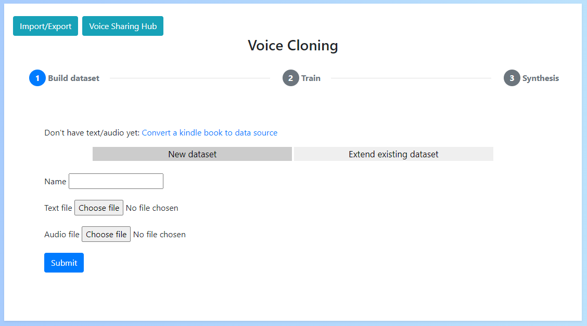

# Voice Cloning App

A Python/Pytorch app for easily synthesising human voices

## [Documentation](https://benaandrew.github.io/Voice-Cloning-App/)

## [Discord Server](https://discord.gg/wQd7zKCWxT)

## [Video guide](https://www.youtube.com/playlist?list=PLk5I7EvFL13GjBIDorh5yE1SaPGRG-i2l)

## [Voice Sharing Hub](https://voice-sharing-hub.herokuapp.com/)

## [FAQ's](faqs.md)

## System Requirements
- **Windows 10 or Ubuntu 20.04+ operating system**
- **5GB+ Disk space**
- NVIDIA GPU with at least 4GB of memory & driver version 456.38+ (optional)

## Key features
- Automatic dataset generation (with support for subtitles and audiobooks)
- Additional language support
- Local & remote training
- Easy train start/stop
- Data importing/exporting
- Multi GPU support

## Manual Guides
- [Installation](install.md)
- [Building the dataset](dataset/dataset.md)
- [Training](training/training.md)
- [Synthesis](synthesis/synthesis.md)
- [Making changes](maintenance.md)

## Future Improvements
- Add support for Talknet
- Add GTA alignment for Hifi-gan
- Improved batch size estimation
- AMD GPU support

## Other resources
- [Remote training notebook](https://colab.research.google.com/drive/1YbB_gA2_Rspmm1TDyEDueNXittmtWu1c?usp=sharing)
- Try out existing voices at [uberduck.ai](https://uberduck.ai/) and [Vocodes](https://vo.codes/)
- [Youtube data fetching](https://colab.research.google.com/drive/1_ulm1DKPOw8n0dHt8__2BR4d9WrWdWA4?usp=sharing) (created by Diskr33t#5880)
- [Synthesize in Colab](https://colab.research.google.com/drive/18IJZZDW1NO7KOslg_WMOCrMeiqz9jOYF?usp=sharing) (created by mega b#6696)
- [Generate youtube transcription](https://colab.research.google.com/drive/1KfAJig2jekpjJ5QS8Lpjy8sTd8w_ZuFv?usp=sharing) (created by mega b#6696)
- [Wit.ai transcription](https://colab.research.google.com/drive/1i5hJRZVc0S-tgt5XM8kSoTu2nHBPOPrF#scrollTo=dk689PtThOjn)

## Acknowledgements
This project uses a reworked version of [Tacotron2](https://github.com/NVIDIA/tacotron2). All rights for belong to NVIDIA and follow the requirements of their BSD-3 licence.

Additionally, the project uses [DSAlign](https://github.com/mozilla/DSAlign), [Silero](https://github.com/snakers4/silero-models), [DeepSpeech](https://github.com/mozilla/DeepSpeech) & [hifi-gan](https://github.com/jik876/hifi-gan).

Thank you to Dr. John Bustard at Queen's University Belfast for his support throughout the project.

Supported by [uberduck.ai](https://uberduck.ai/), reach out to them for live model hosting.

Also a big thanks to the members of the [VocalSynthesis subreddit](https://www.reddit.com/r/VocalSynthesis/) for their feedback.

Finally thank you to everyone raising issues and contributing to the project.
