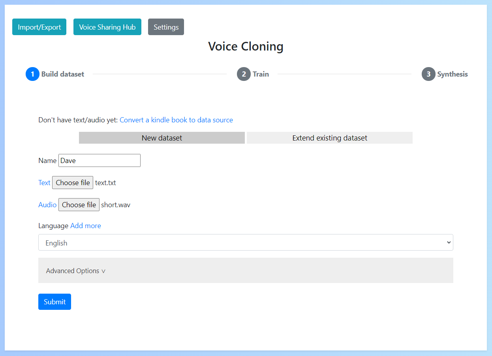
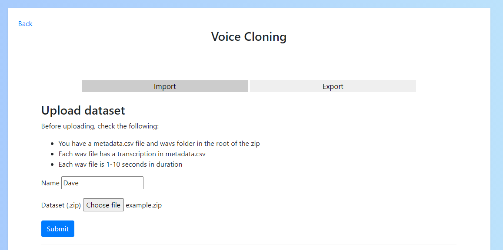

# Dataset

A voice dataset consists of audio (of the target voice) and text (labelling what is in said in the audio).

## Selecting a source

Before creating a voice dataset it is important to ensure you've selected a suitable candidate for which you can obtain audio file(s) and text transcriptions (either plaintext or subtitles).

The most common source is audiobooks because the audio is clear and labelled, but you may be able to extract from other sources such as podcasts. Check the criteria in [Verify your source](#verify-your-source) to determine whether your given source will be suitable.

### Extracting from audible/kindle

Audible & Kindle are a great source for gathering the audio & text data needed for the voice dataset.

To build a data source, firstly purchase a matching audible & kindle book (typically referred to [whispersync](https://www.amazon.co.uk/gp/feature.html?ie=UTF8&docId=1000812303) on amazon).

Then do the following to extract the audio & text:

**Audible to audio**

To convert an audible audio book to an audio file (.mp3) I use [AaxAudioConverter](https://github.com/audiamus/AaxAudioConverter"). Here are the steps to install and use:

1. Download and install the [Windows Audible app](https://www.microsoft.com/en-gb/p/audiobooks-from-audible/9wzdncrfj1cr)
2. Open the audible app and download the audiobook you wish to convert
3. Download [AaxAudioConverter](https://github.com/audiamus/AaxAudioConverter/releases/download/v1.16/AaxAudioConverter-1.16-Setup.exe)
4. Run the application and click "Add" in the top left

5. Select the audiobook you downloaded in the audible app
6. Select "MP3" as the export format and "Single file per AAX file". Then click convert


**Kindle to text**
To convert a kindle book to text file (.txt):

1. Download and install [Kindle App version 1.17](http://www.mediafire.com/file/ku208jm2ccqvn1w/KindleForPC-installer-1.17.44183.exe/file") (NOTE: It must be this version or earlier to work)
2. Open the kindle app and download the book you wish to convert
3. Go to "Documents\My Kindle Content" and find your kindle book (.azw file)

4. Upload this file to [Convert to a txt](https://onlineconvertfree.com/complete/azw-txt/)

If this doesn't work you can also follow the [DeDRM guide](https://github.com/apprenticeharper/DeDRM_tools/wiki/Exactly-how-to-remove-DRM)

## Verify your source

### Audio

Check the following about your source audio before starting:

- The audio is clear (without background noise)
- The audio only includes the target speaker (the voice of the person you want to clone)
- The total duration of the audio file(s) is several hours long
    - In some cases less audio may work, but this is not advised

If your audio does not meet any of these requirements, it is unlikely to be successful.

### Text/Subtitles

Check the following about your source text before starting:

- The text accurately labels what is said in the audio
- The text includes punctuation

If your text does not accurately match your audio, the dataset cannot be built.

## Building a dataset

### Using the app

To build a dataset in the app you can simply upload your source audio/text and enter a name for the dataset.

If using another language you can select this here (to add a language see [Adding languages](../#adding-languages))



Once you do this a progress bar will appear, meaning that the dataset building process has started. You must wait for this progress bar to complete and the 'Next' button to appear before continuing.


Your dataset has now been generated.

### Manually creating a dataset

If for whatever reason you cannot use the dataset generator or want to create your dataset manually, this is possible.

To do so you'll need to extract 1-10 second clips from your audio (I would suggest using an app such as [Audacity](https://www.audacityteam.org/) to do this).

Save these clips to a folder called `wavs` inside your dataset folder.

Next, you'll need to create the labels file. To do this create a file called `metadata.csv` and add what is said in each clip in the format `filename|transcription`. For example:

```
Clip1.wav|Hi, my name is Dave?
Clip2.wav|Great weather we're having.
...
```

This leaves the final format of the dataset folder to be something like this:

    metadata.csv   # The labels file
    wavs/          # The audio clips folder
        Clip1.wav  
        Clip2.wav
        ...


You can then import the dataset into the app by zipping it and adding under the "Import/Export" menu -> "Upload dataset".



## Manage datasets

To manage your datasets click "Manage datasets" in the top left.

This will provide a page where you can select your dataset and view it's details.

You can also see any clips the dataset generator was not able to label and manually label them yourself.


You can delete your datasets/models from "Settings".
