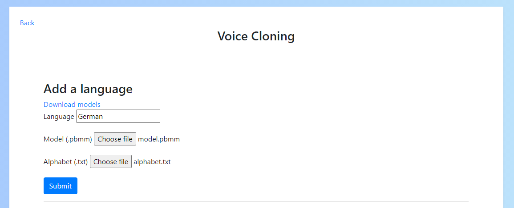

# Welcome to the Voice Cloning App

A Python/Pytorch app for easily synthesising human voices.

## Getting started

After installing & running the app it should open in your browser at [localhost:5000](http://localhost:5000/)

### Windows

Download the latest release from [releases](https://github.com/BenAAndrew/Voice-Cloning-App/releases)

- If you have an NVIDIA GPU make sure to download the executable with GPU support
- Otherwise, download the 'cpuonly' version

### Linux

1. Clone this repository
2. Run `./install.sh` from the root of the repository
3. Run `python3.6 main.py`

### Manual Install (Linux/ Windows)

Users familiar with Python may prefer building the app themselves:

1. Clone this repository
2. Install [Python](https://www.python.org/) (version 3.6)
3. Run `pip install -r requirements.txt` 
    - (or `pip install -r requirements-cpu.txt` for the 'cpuonly' build)
4. Run `python main.py`

## Adding languages

If you are using a language other than English you can add it to the app.

Firstly, you'll need to find a deepspeech model for your language by going to [coqui](https://coqui.ai/models).
You'll then need to download the `model.pbmm` and `alphabet.txt` files for your language.

To add this to the app go to "Settings" -> "Add a language", enter your language name and upload your language files

Please note that language model quality may vary and so successful generation of voices in other languages is not guarenteed. 
