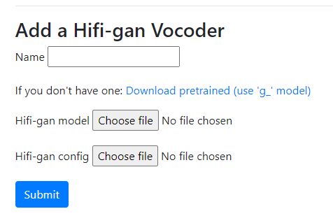

# Synthesis

Once you've trained a voice model, you can produced synthesised audio.

## Add a vocoder

Vocoder's are the models that convert the results generated by your voice model into audio.

The app currently supports [Hifigan](https://github.com/jik876/hifi-gan) models which can be imported into the app in "Settings" -> "Add a vocoder".

You will need to enter a name for the vocoder and upload the `g_02500000` model and `config.json` which can be downloaded from the [sample link](https://drive.google.com/drive/folders/1YuOoV3lO2-Hhn1F2HJ2aQ4S0LC1JdKLd) provided

## Synthesize

After you have a voice model and a [vocoder](#add-a-vocoder) you can synthesize results. 

The first step in this process is to select your voice name, checkpoint (this is the voice model, choose the most recent version), language and vocoder.

Once you've done this you can now enter the text you want to produce results for. To do this there are 3 options:

- Single line: A single sentence you want to produce reults for
- Multi line: Multiple sentences produced together and then joined
- Paragraph: A paragraph of text split automatically into multiple sentences which are then synthesized and joined

If you don't know where to start, just choose "Single line" and enter a simple sentence like "This is a sample sentence.". 

**Please note: If your sentence is too short (i.e. < 5 words) or too long (i.e. > 20 words) then synthesis may not work**

Once you press submit, results should be generated. From here you can view the alignment graph which shows how well the text & audio have aligned (this should form a relatively clear diagonal line) and listen to the audio.

You can also modify the text at the bottom and press submit to generate more synthesised results.

If audio could not be produced or was poor this may be due to the given text (either being too short/long or containing difficult words for your voice) or [poor voice quality](../training/#verifying-quality)