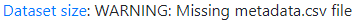
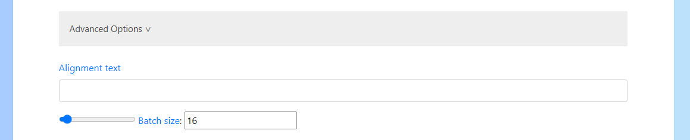
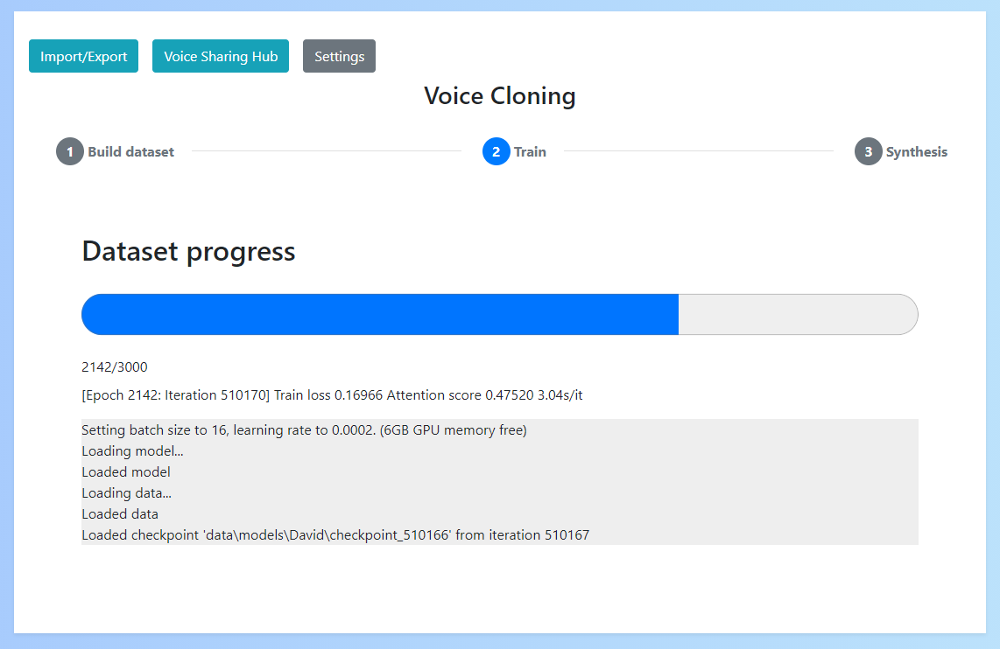
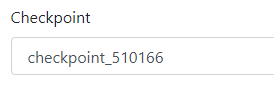
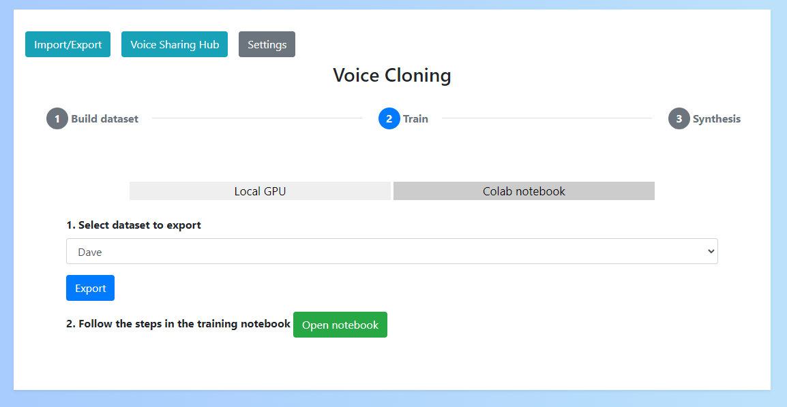
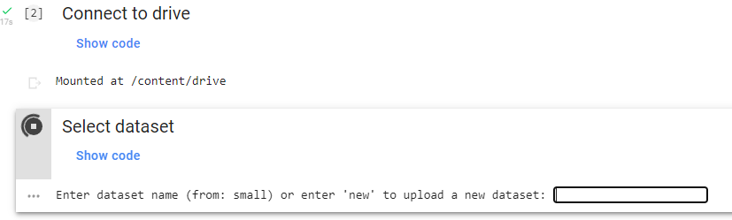
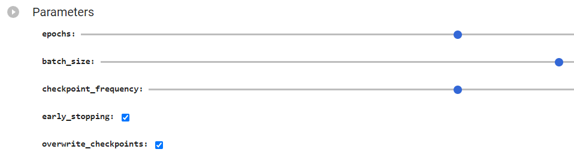

# Training

Training can be done locally (if you have an NVIDIA GPU with more than 4GB of memory) or remotely (on [Google colab](https://colab.research.google.com/))

## Local training

Before starting training you'll need to set various parameters

### Select your dataset

You can select your dataset from the dropdown on the training form. 

When you select a dataset, a message will appear underneath the dropdown which tells you it's total size. This is important, because a dataset that is too small is unlikely to work.

If your dataset is invalid or has been corrupted an error will show instead. In this case you will need to recreate or fix the dataset.

### Parameters

In addition to selecting the dataset you'll need to set 3 required parameters:

- Pretrained model: This is a file that helps the model to generate high quality results. The recommended option is the use the default provded by NVIDIA. This can be downloaded from the "default" link
- Language: The language used in the dataset
- Epochs: This is the number of cycles over the dataset. Increasing this will increase quality (to a point) but also increases training time
    - Smaller datasets need less epochs to reach max quality than bigger ones
    - The reccommended approach is to start with a small amount (say 500) and then revisit training to continue until you are happy with the results
    - Once you reach the maximum quality of your voice, continuing to train will not improve results and may make this worse

### "CUDA Out of Memory error"

A common error during training is "CUDA of of memory".
What this means is that your GPU ran out of memory whilst training.

To resolve this you need to decrease the batch size which can be found under Advanced Options. Do this a little at a time and retry until training works successfully.

### During training

During training you'll see the standard progress bar which indicates the training progress. 

Under the progress bar you'll also see a message which includes some important stats:

- Train loss: The loss score indicates how well the model is learning the training data. A low score is best but remember this can be misleading as a low score is also possible for [overfitting](https://www.ibm.com/cloud/learn/overfitting)
- Attention score: A score which roughly represents how well text is linking to audio. Higher the better

**Remember: If you want to stop and continue later this is not a problem as checkpoints are saved frequently.**

Additionally, if you set the "Alignment text" in Advanced Options to a test sentence you'll see an alignment graph each time a checkpoint is saved. This shows how well the text/aduio is aligning, with close to diagonal line being ideal

### Continuing training 

Training can be stopped at any time and resumed later.

When you revisit training you'll see a dropdown to select the checkpoint to resume training from. You should select the latest checkpoint when doing so.

This will restore your training to the point it was at when the checkpoint was created. The frequency that checkpoints are saved can be set in the "advanced options" of training.

## Remote training

Remote training works the same as local training but executes in Google colab to use a remote GPU.

### Exporting the dataset

You'll firstly need to export your dataset from the app to upload to the notebook. You can do so by selecting your dataset from the dropdown and clicking "Export".

You can then click "Open notebook" to launch the notebook.

To add your dataset, you'll need to unzip and upload the folder to your google drive under the path `Voice-Cloning/datasets`.
If you have already run the notebook as far as the step where you conenct to the google drive, you'll notice this folder already exists.

You can then select the dataset by entering its name into the 3rd cell.

### Parameters

Parameters can be set by changing the values in the 4th cell. Note that you'll need to set these before you run the cell or they won't work.

Unlike local training, you will not need to upload a pretrained model as this is done for you automatically.

### Checkpoints

Checkpoints are created just like in local training and are saved to `Voice-Cloning/checkpoints` in your google drive.

When you want to try the checkpoint out, simply download it and import it into the app under "Import/Export" -> "Upload model"

## Verifying quality

To identify whether you have produced a good voice model you can stop training at any time and test your model in [synthesis](../synthesis)

However, you can also tell whether your model quality will be good by looking at a variety of other factors:

- Train loss: Did your train loss decrease to a consistent value (typically < 0.5)?
- Attention score: Did your attention score increase to a consistent value (typically > 0.3)?
- Alignment graph: If you enabled the alignment graph (by using an "Alignment sentence" in advanced settings) did this form a relatively clear line?

If any of these things are not true, then your model may not be good quality. There are a number of possible reasons for this:

- Your dataset was not good enough quality (see [Verify your source](../dataset/#verify-your-source) for possible reasons why)
- You did not train for long enough
    - Did you upload a transfer learning model?
    - Did you train for 500+ epochs?
